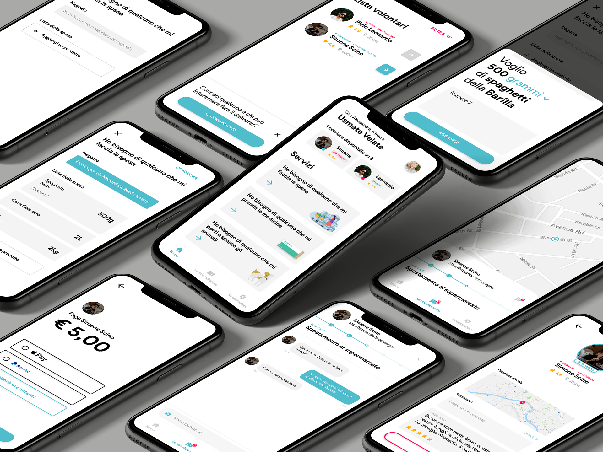

# covidelivery

## Inspiration
In questa situazione di emergenza, per salvaguardare la nostra salute e quella degli altri ci viene chiesto di uscire di casa solo per motivi di necessità, come fare la spesa e andare in farmacia.
Abbiamo pensato a un progetto che sia di sostegno a coloro che hanno bisogno di assistenza in questo genere di situazioni.
In particolare volevamo organizzare in modo efficiente ed efficace la consegna a domicilio di beni di prima necessità.

## What it does
Abbiamo pensato che non tutti si sentono al sicuro a uscire di casa, anche se si tratta di comprare cibo e medicinali. E che invece ci sono delle persone disposte ad addossarsi questo rischio che potrebbero prestare aiuto a chi si trova in difficoltà svolgendo commissioni per loro.
La nostra idea è creare un modo per organizzare le richieste di servizi e presa in carico di queste. Per farlo, abbiamo pensato a un'applicazione che metta in contatto chi si propone di svolgere la consegna e chi ha bisogno di assistenza. 

## How I built it
L'applicazione CoviDelivery è stata creata con il framework Flutter di Google che permette di sviluppare app native per Android, iOS e  Web con lo stesso codice sorgente.

La prima fase del progetto si è concentrata sulla creazione dell'interfaccia prima dei mockup e wireframe creati su Adobe XD, che successivamente sono stati riprodotti in Flutter tramite codice Dart, creando, widget per widget, le pagine dell'app. Dopodiché abbiamo proseguito con la progettazione della struttura del database e la sua implementazione nell'app.

## Challenges I ran into
Volevamo trovare un modo di organizzare le consegne con efficienza, così da rendere le uscite meno frequenti possibile. Infatti abbiamo imposto il limite di due richieste di consegna a settimana per ogni indirizzo. Inoltre, ogni “Deliverer” potrà prendere in carico più richieste (in base alla zona in cui si trova e a quanto spazio ha disponibile per il trasporto dei beni).

## Accomplishments that I'm proud of
Siamo fieri di aver realizzato questa applicazione sapendo che potrebbe essere d'aiuto a molte persone

## What I learned
Abbiamo imparato che è un campo delicato e ci sono molti aspetti da tenere in considerazione per poter ideare qualcosa che sia davvero utile alla comunità.

## What's next for CoviDelivery
Vorremmo rendere disponibile l’applicazione anche per orologi digitali come AppleWatch, il che la renderebbe molto più comoda da utilizzare soprattutto per quelli che noi abbiamo chiamato “Deliverer”, cioè chi si occupa di consegnare.